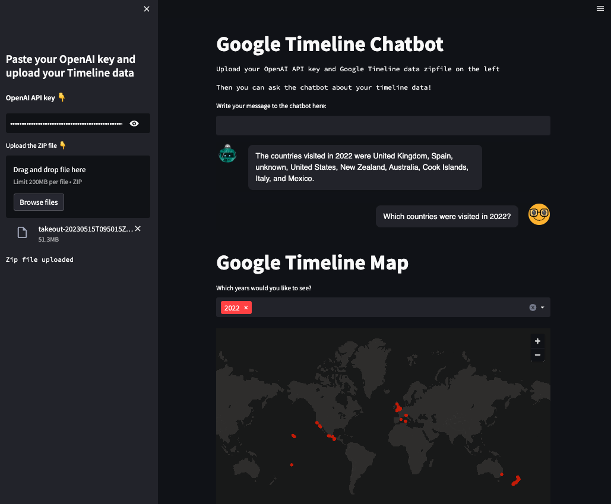

# gmap_timeline

## Interact with your Google Timeline data!

(Currently underdevelopment) 

- Chat with the Chatbot to query the data with natural language.
- Use the interactive map to visualise places visited by year. 

Powered by OpenAI, LangChain and Streamlit. 

[Try the app here](https://pdjewell-my-gmap-timeline-app-v2-lunix4.streamlit.app/)

A screenshot from the app:

